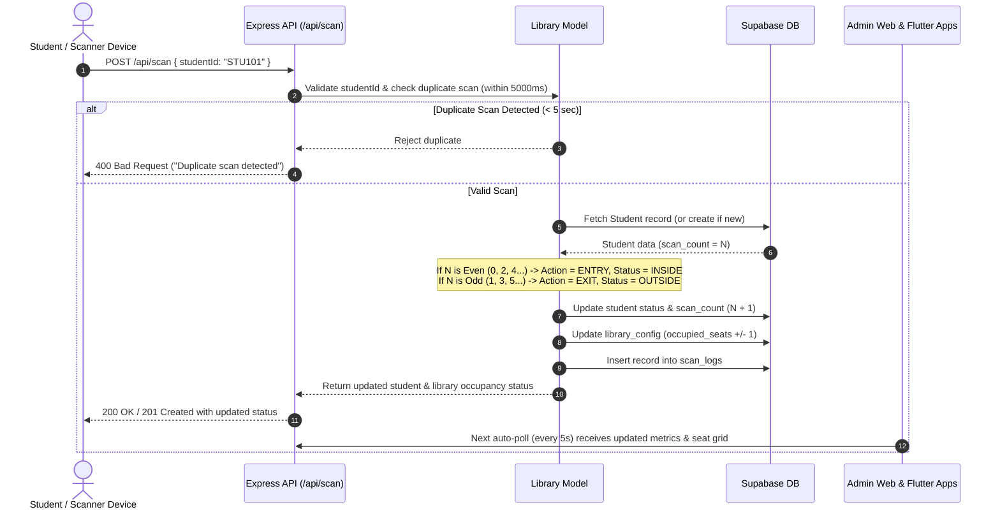
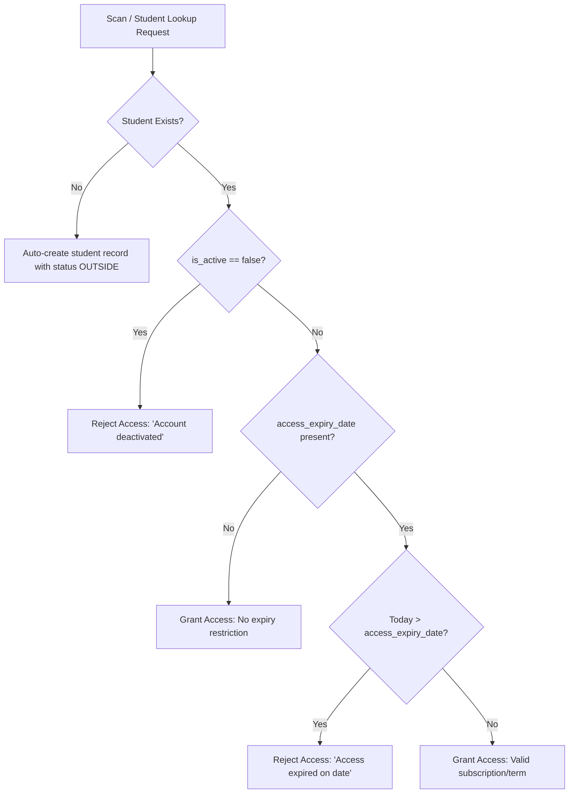

# 🔄 Smart Library: Project Flow & Codebase Architecture

**Repository:** `Smart-Library`  
**Architecture Version:** 1.0 (Supabase-Powered Multi-Client Ecosystem)  

---

## 1. High-Level System Architecture

The Smart Library system operates as a unified distributed platform connecting physical hardware scanners, cloud databases, REST API servers, administrative web portals, and mobile client applications.

```mermaid
graph TD
    subgraph Physical Hardware Layer
        A1[RFID / Barcode Card Reader] -->|USB Keyboard Emulation / Webhook| B[Backend API Gateway]
    end

    subgraph Clients & Frontends
        C1[Admin Web Panel - Tailwind/JS] <-->|REST API HTTP/JSON| B
        C2[Flutter Mobile App - Admin Role] <-->|REST API / Supabase SDK| B
        C3[Flutter Mobile App - Student Role] <-->|REST API / Supabase SDK| B
    end

    subgraph Backend Services
        B[Node.js + Express + TypeScript]
        B --> M1[library.controller.ts]
        M1 --> M2[library.model.ts]
        M2 --> M3[access_expiry.ts]
    end

    subgraph Cloud Storage & Database
        M2 <-->|@supabase/supabase-js| DB[(Supabase PostgreSQL)]
        DB --- T1[(library_config)]
        DB --- T2[(students)]
        DB --- T3[(scan_logs)]
    end
```

---

## 2. End-to-End Operational Flows

### A. Student Scan Flow (Entry / Exit Toggle)

The core mechanism of the Smart Library relies on a deterministic **Odd/Even Scan State Machine**:



#### Key Algorithm Details:
1. **Duplicate Throttle:** Checks the most recent entry in `scan_logs` for `student_id`. If `timestamp < 5000ms`, the request is rejected immediately with HTTP 400.
2. **Deterministic Status Calculation:**
   - `scan_count % 2 === 0` $\rightarrow$ **ENTRY** $\rightarrow$ Student `current_status = 'INSIDE'`, `occupied_seats += 1`.
   - `scan_count % 2 === 1` $\rightarrow$ **EXIT** $\rightarrow$ Student `current_status = 'OUTSIDE'`, `occupied_seats = max(0, occupied_seats - 1)`.
3. **Safety Guards:**
   - Prevents `occupied_seats` from ever dropping below `0`.
   - Logs administrative warnings if occupancy exceeds `total_seats`.

---

### B. Dynamic Seat Map & Pictograph Flow

The backend transforms flat student occupancy data into a visual 2D matrix consumed by both the Web Panel and Flutter Mobile apps.

```mermaid
flowchart LR
    A[Client calls GET /api/seats] --> B[Controller fetches library_config]
    B --> C[Controller fetches all students where status = 'INSIDE']
    C --> D[Compute Grid: rows = ceil(totalSeats / cols), default cols = 10]
    D --> E[Assign each INSIDE student sequentially to Seat #1..K]
    E --> F[Assign remaining seats K+1..N as AVAILABLE]
    F --> G[Return JSON 2D Matrix with Occupancy Rate & Seat Coordinates]
    G --> H[Admin Web / Flutter renders interactive visual grid]
```

---

### C. Access Expiry & Student Verification Flow



---

### D. Administrative Reset Flow

1. Administrator clicks **"Reset System"** on the Admin Web Panel or Flutter Admin Screen.
2. Client sends `POST /api/reset`.
3. Backend runs batch updates on Supabase:
   - `UPDATE students SET current_status = 'OUTSIDE', scan_count = 0 WHERE id != ''`
   - `UPDATE library_config SET occupied_seats = 0, last_updated = NOW() WHERE id = 1`
4. Returns HTTP 200 with confirmation.
5. All attached client dashboards automatically update their cards and clear occupied seats on their next 5-second polling tick.

---

## 3. Codebase Directory Map & Component Roles

```
Smart-Library/
├── .github/
│   └── workflows/
│       ├── ci.yml                     # Continuous Integration: lint, type-check, test
│       └── cd-backend-docker.yml       # Continuous Deployment: build/push Docker image to GHCR
├── admin-web/                         # Administrative Web Dashboard
│   ├── css/
│   │   └── custom.css                 # Custom glassmorphism, animations & styles
│   ├── js/
│   │   ├── api.js                     # Centralized API fetcher & error handling
│   │   ├── config.js                  # Frontend configuration & API base URLs
│   │   ├── main.js                    # Event listeners, auto-refresh polling loop
│   │   └── ui.js                      # DOM renderers for stats, tables, modals, badges
│   └── index.html                     # Single-page admin portal interface
├── backend/                           # Express.js + TypeScript Backend
│   ├── src/
│   │   ├── config/
│   │   │   └── database.ts            # Supabase client instantiation & startup verification
│   │   ├── controllers/
│   │   │   └── library.controller.ts  # Scan logic, seat generation, status, reset
│   │   ├── middleware/
│   │   │   └── errorHandler.ts        # Global 404 & 500 error handlers
│   │   ├── migrations/
│   │   │   └── 001_extend_students_table.sql # SQL migration for expiry & active status
│   │   ├── models/
│   │   │   └── library.model.ts       # Database queries, student operations, status updates
│   │   ├── routes/
│   │   │   └── library.routes.ts      # REST API route definitions
│   │   ├── tests/
│   │   │   ├── library.test.ts        # Integration test suite for library endpoints
│   │   │   ├── setup.ts               # Test environment bootstrap
│   │   │   └── simple.test.ts         # Lightweight smoke test suite for CI
│   │   ├── types/
│   │   │   └── library.types.ts       # TypeScript interfaces for Student, Log, Status, Seat
│   │   ├── utils/
│   │   │   └── access_expiry.ts       # Expiry date parsing & validation utilities
│   │   └── server.ts                  # Express server bootstrap, middleware, lifecycle
│   ├── Dockerfile                     # Standard container build
│   ├── Dockerfile.fresh               # Fresh production build container
│   ├── jest.config.js                 # Jest unit testing config
│   ├── package.json                   # Backend dependencies & script definitions
│   ├── simple-server.js               # Standalone fallback/debug server
│   └── tsconfig.json                  # TypeScript compiler options
├── flutter_app/                       # Flutter Mobile Application
│   ├── lib/
│   │   ├── config/                    # Theme, API URLs, constants
│   │   ├── models/                    # Student, Status, SeatMap, ScanLog Dart models
│   │   ├── providers/                 # AuthProvider, LibraryProvider, ThemeProvider
│   │   ├── screens/
│   │   │   ├── admin/                 # 9 Admin screens (Dashboard, Scanner, Seats, etc.)
│   │   │   ├── student/               # 4 Student screens (Home, Profile, History, etc.)
│   │   │   └── login_screen.dart      # Role selection & authentication
│   │   ├── services/                  # ApiService, SupabaseService, StorageService
│   │   ├── widgets/                   # SeatMapWidget, StatCard, LoadingSkeleton, Dialogs
│   │   └── main.dart                  # Flutter entrypoint & MultiProvider setup
│   ├── analysis_options.yaml          # Flutter lint rules
│   ├── pubspec.yaml                   # Flutter dependencies & assets configuration
│   └── TODO_FIX.md                    # Detailed analyzer and lint cleanup checklist
├── Status Report/                     # Project Status, Roadmaps, & Task Assignments
│   ├── PROJECT_STATUS_AND_ROADMAP_2026-08 (1).md # Original project roadmap
│   ├── WORK_SUMMARY_AND_TECH_STACK.md # Summary of completed works & tech stack
│   ├── PROJECT_FLOW_AND_CODEBASE_ARCHITECTURE.md # (This file)
│   ├── TODO_LIST_AND_ASSIGNMENTS.md   # Daily task assignments (Day 1 - Day 5)
│   └── tasks.txt                      # Concise task reference list
├── docker-compose.yml                 # Docker multi-container composition
└── README.md                          # Root project documentation & quick start guide
```
